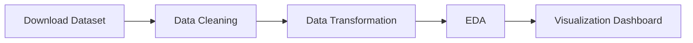

<!-- ======================= -->

<!-- ANIMATED HEADER -->

<!-- ======================= -->

<p align="center">
  
</p>

<p align="center">
  
</p>

---

# 🎬 Netflix Content Analytics Dashboard

📊 Project ini merupakan analisis data Netflix menggunakan Python yang mencakup proses **data cleaning, exploratory data analysis (EDA), dan visualisasi dalam bentuk dashboard interaktif**.

---

## 🚀 Features

* ✨ Data Cleaning otomatis
* 📈 Trend Analysis (per bulan)
* 🌍 Top Country Analysis
* 🎭 Content Distribution (Movie vs TV Show)
* 🔥 Heatmap Rating vs Type
* 📊 Dashboard visual (4 grafik dalam 1 tampilan)

---

## 🧰 Tech Stack

<p align="center">
  
</p>

* Python
* Pandas
* Matplotlib
* Seaborn
* Google Colab
* Kaggle API

---

## 📂 Dataset

Dataset diambil dari Kaggle:
**Netflix Movies and TV Shows Dataset**

Dataset berisi:

* Title
* Type
* Director
* Country
* Date Added
* Rating

---

## ⚙️ Data Processing Pipeline



---

## 📊 Dashboard Preview

<p align="center">
  
</p>

> ⚠️ Disarankan mengganti GIF ini dengan screenshot dashboard hasil project kamu sendiri.

---

## 📈 Key Insights

* 📌 Puncak penambahan konten terjadi pada periode tertentu
* 🌎 Negara dengan kontribusi konten terbanyak dapat diidentifikasi
* 🎬 Distribusi konten didominasi oleh salah satu tipe (Movie / TV Show)
* 🔥 Heatmap menunjukkan hubungan antara rating dan tipe konten

---

## ▶️ How to Run

```bash
# Install Kaggle
pip install kaggle

# Download dataset
kaggle datasets download -d shivamb/netflix-shows

# Extract dataset
unzip netflix-shows.zip
```

Lalu jalankan notebook di Google Colab.

---

## 📌 Output

✔️ Dashboard visual:

* Line Chart (Trend penambahan konten)
* Bar Chart (Top 10 negara)
* Pie Chart (Distribusi konten)
* Heatmap (Rating vs Type)

✔️ Insight otomatis dari program:

* Peak upload
* Negara dominan
* Tipe konten dominan

---

## 🧠 Conclusion

Project ini menunjukkan bahwa data Netflix memiliki pola yang dapat dianalisis untuk memahami:

* Tren penambahan konten
* Distribusi berdasarkan negara
* Preferensi tipe konten
* Pola rating

Visualisasi dashboard membantu menyajikan informasi secara lebih jelas dan mudah dipahami.

---

## 📎 Submission Note

Project ini dikumpulkan dalam bentuk repository GitHub sesuai instruksi, yang berisi:

* Source Code (Notebook)
* Dataset
* Visualisasi
* Dokumentasi (README)

---

<p align="center">
  
</p>
